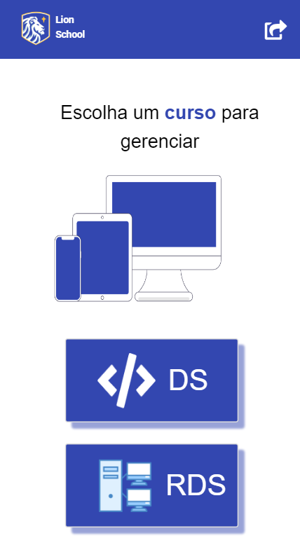
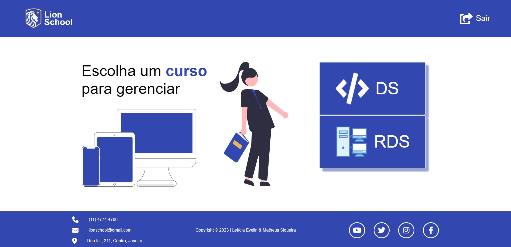

|      MOBILE         |          DESKTOP       |
|:-------------------:|:-----------------------:
|||
|                     |                        

### [Clique aqui]() para acessar o site!

## Objetivo

A atividade tem como objetivo integrar as disciplinas de PWFE (Programação web Front-end) e PWBE (Programação web Back-end) do curso de desenvolvimento de sistemas do [SENAI Jandira](https://jandira.sp.senai.br/) .

O projeto é o gerenciamento da escola Lion School, deverá ser realizado tanto o back-end como o front-end.

---

### Figma

Link do [figma](https://www.figma.com/file/c2Kz6BUJN6QNGYMRabvOqj/Untitled?node-id=0-1&t=1QSq4RGwzLtWuXEu-0).

## Tecnologias utilizadas
- CSS
- JSON
- HTML
- Node.js
- Markdown
- JavaScript
- Responsividade

## Critérios de Avaliação
- [x] Criou layout conforme designer feito no Figma?
- [x]  Os botões dos cursos são dinâmicos?
- [x] Os cards são criados dinamicamente?
- [x] A página com informações dos cursos foi criada dinamicamente?
- [x] O filtro por status está funcional?
- [x] Os nomes das variáveis, funções e arquivos tem valor semântico?
- [x] A maioria das funções seguem as boas práticas como responsabilidade única?
- [x] Foi criado variáveis pensando nas boas praticas?
- [x] Foi criado o layout responsivo no Figma?
- [x] Foi implementado a responsividade conforme planejado no Figma?
- [x] Foi criado o filtro por ano?

## Autores
- [Letícia Evelin](https://github.com/leticia-evelin)
- [Matheus Siqueira](https://github.com/Ma7hs)